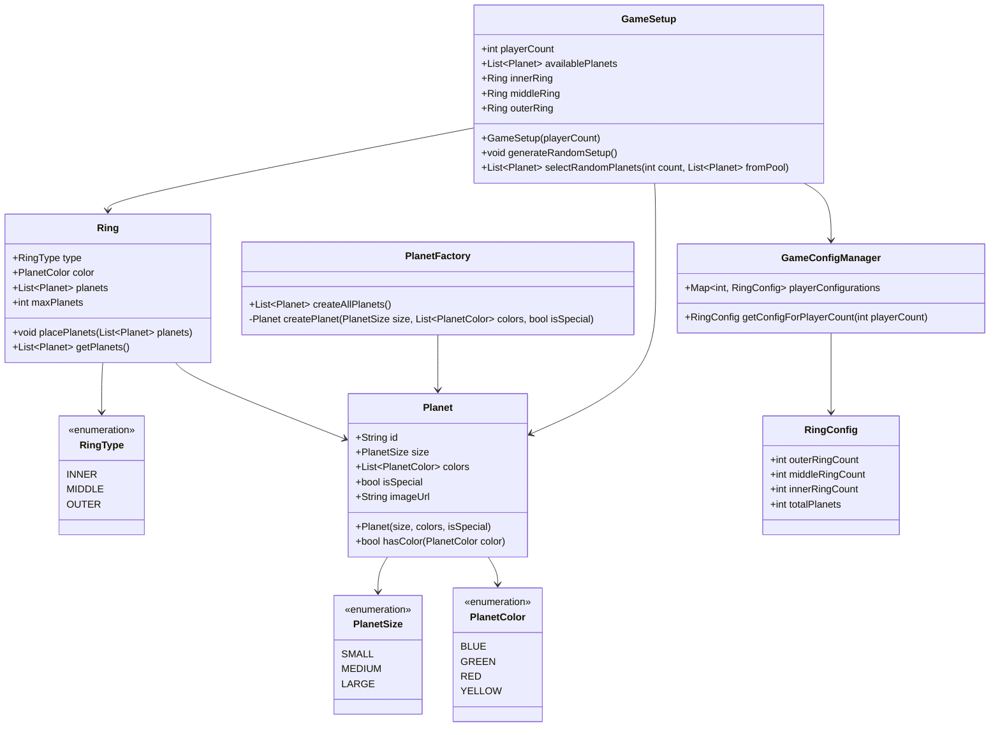

# Last Light Randomizer Class Diagram

```mermaid
classDiagram
    class Planet {
        +String id
        +PlanetSize size
        +List~PlanetColor~ colors
        +bool isSpecial
        +String imageUrl
        +Planet(size, colors, isSpecial)
        +bool hasColor(PlanetColor color)
    }

    class PlanetSize {
        <<enumeration>>
        SMALL
        MEDIUM
        LARGE
    }

    class PlanetColor {
        <<enumeration>>
        BLUE
        GREEN
        RED
        YELLOW
    }

    class Ring {
        +RingType type
        +PlanetColor color
        +List~Planet~ planets
        +int maxPlanets
        +void placePlanets(List~Planet~ planets)
        +List~Planet~ getPlanets()
    }

    class RingType {
        <<enumeration>>
        INNER
        MIDDLE
        OUTER
    }

    class GameSetup {
        +int playerCount
        +List~Planet~ availablePlanets
        +Ring innerRing
        +Ring middleRing
        +Ring outerRing
        +GameSetup(playerCount)
        +void generateRandomSetup()
        +List~Planet~ selectRandomPlanets(int count, List~Planet~ fromPool)
    }

    class PlanetFactory {
        +List~Planet~ createAllPlanets()
        -Planet createPlanet(PlanetSize size, List~PlanetColor~ colors, bool isSpecial)
    }

    class GameConfigManager {
        +Map~int, RingConfig~ playerConfigurations
        +RingConfig getConfigForPlayerCount(int playerCount)
    }

    class RingConfig {
        +int outerRingCount
        +int middleRingCount
        +int innerRingCount
        +int totalPlanets
    }

    Planet --> PlanetSize
    Planet --> PlanetColor
    Ring --> RingType
    Ring --> Planet
    GameSetup --> Ring
    GameSetup --> Planet
    PlanetFactory --> Planet
    GameSetup --> GameConfigManager
    GameConfigManager --> RingConfig
```